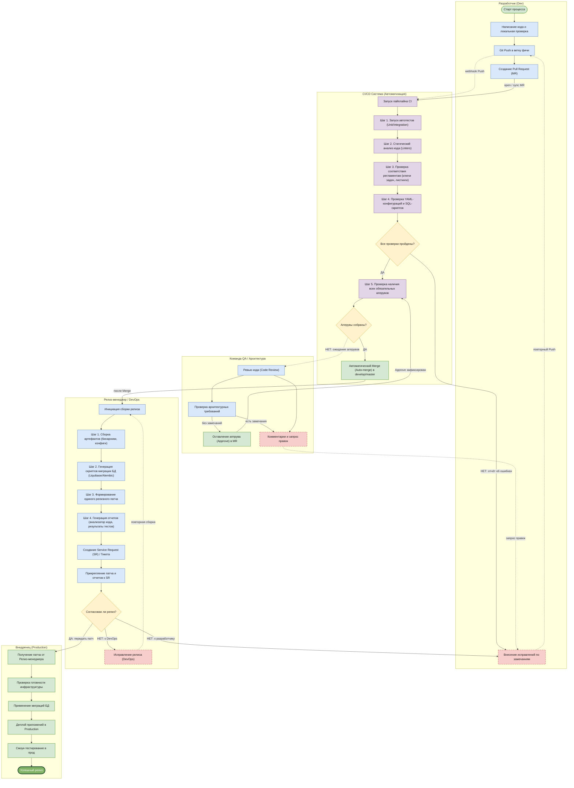

# Диаграмма CI/CD для draw.io

Готовый файл со **swimlanes (дорожками ролей)**: [`cicd-process.drawio`](cicd-process.drawio).

Версия с **чистой маршрутизацией**: возвраты идут только по левому «коридору возвратов», happy-path слева направо, междорожечные передачи — короткие вертикали в одной колонке.

Для копирования XML: [`cicd-process-xml-paste.txt`](cicd-process-xml-paste.txt).

## Способ 1 (рекомендуется): открыть `.drawio`

1. Откройте [https://app.diagrams.net](https://app.diagrams.net) (или desktop draw.io).
2. **File → Open from → Device** и выберите `docs/cicd-process.drawio`.
3. Либо перетащите файл в окно браузера.

Так сохраняются настоящие BPMN-дорожки, цвета шлюзов и межролевые стрелки.

## Способ 2: вставить XML

1. **File → New → Blank diagram**.
2. **Extras → Edit Diagram…**
3. Замените содержимое XML из `cicd-process.drawio` целиком (от `<mxfile>` до `</mxfile>`).
4. **OK**.

## Способ 3: вставить Mermaid

**Arrange → Insert → Advanced → Mermaid** — вставьте код ниже.

Draw.io превращает `subgraph` в группы, а не в классические swimlanes. Для дорожек используйте способ 1 или 2.

