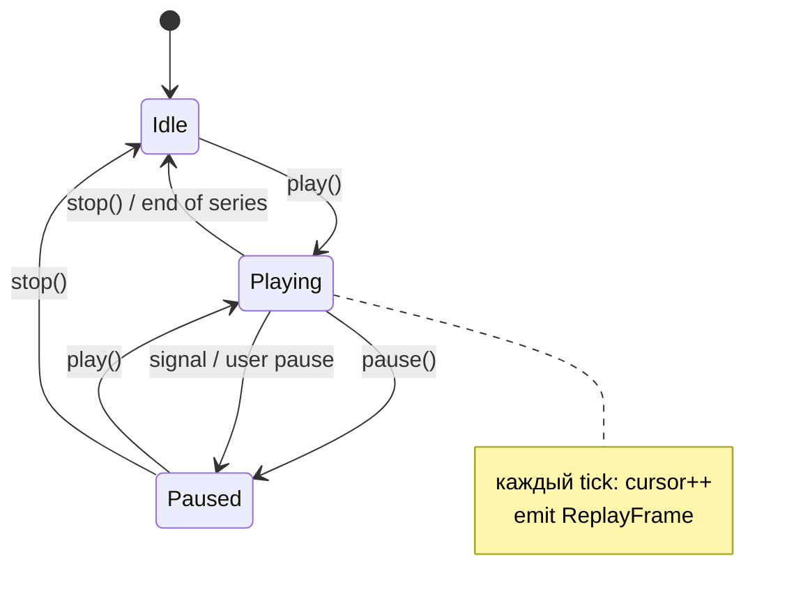

# Симулятор десктоп (черновик)

> Полный документ десктоп-симулятора ещё не в main; ниже — раздел Bar Replay, нужный для Android MVP.

# Replay-симулятор в стиле TradingView (Bar Replay)

**Кодовое имя:** `Симулятор replay` / `TradingView replay`

**Статус:** черновик UX и архитектуры

**Отличие от «Тест страт.» сейчас:** там график показывает **весь** 255д ряд и **все** сделки сразу. Replay — **бары и сделки появляются по мере «времени»**, с ▶ ⏸ перемоткой и скоростью — как [Bar Replay](https://www.tradingview.com/support/solutions/43000544162) в TradingView.

**Где делать в первую очередь:** вкладка **«Тест страт.»** (или подвкладка **«Симулятор»**) — уже есть `z_chart.html`, маркеры сделок, Z-свечи. Десктопный CLI может переиспользовать тот же `ReplayEngine` из `moex-core`.

---

## UX (как TradingView)

```
┌─────────────────────────────────────────────────────────────┐
│  Z-score · 15м replay          2025-03-12 14:30  Z +1.24   │
├─────────────────────────────────────────────────────────────┤
│                                                             │
│   [график lightweight-charts — только бары ≤ cursor]        │
│   │← вертикальная линия «сейчас»                            │
│   │   маркеры 1А 2Р появляются в момент сигнала             │
│                                                             │
├─────────────────────────────────────────────────────────────┤
│ ⏮  ⏪  ▶/⏸  ⏩  ⏭   │ 1x 2x 5x 10x │  ████████░░  67%     │
│ Старт: [выбор бара / дата]   Позиция: Short   PnL: +1 240 ₽ │
└─────────────────────────────────────────────────────────────┘
```

| Элемент | Поведение |
|---------|-----------|
| **▶ / ⏸** | авто-шаг на следующий 15м бар каждые `baseMs / speed` |
| **⏪ / ⏩** | −1 / +1 бар (пауза) |
| **⏮ / ⏭** | к началу выбранного окна / к последнему закрытому бару |
| **Скорость** | 0.5× … 10× (1× ≈ 1 бар / 0.8–1.2 с реального времени) |
| **Слайдер** | scrub по индексу бара; график обрезается до `cursor` |
| **Старт** | long-press на графике или «Выбрать дату» → `cursor = startIndex` |

Шторка / панель снизу: **позиция** (Flat/Long/Short), **нереализ. PnL**, **сделок сегодня**, пороги вход/выход.

---

## Архитектура



### 1. `ReplayEngine` (Kotlin, без UI)

Переиспользует существующее:

- `determineZStrategySignalBetweenBars` — `MoexIssStrategy.kt`
- `collectZStrategy15mSignalEdgesFull` — пошаговый аналог в цикле — `MoexZStrategy15mReplay.kt`
- `advanceZStrategyPosition` — `MoexDailySimReplay.kt`
- PnL открытой ноги — `estimateOpenSpreadMtmNetRub` — `MoexPortfolioMarketSnapshot.kt`

```kotlin
data class ReplayConfig(
    val points: List<DataPoint>,           // полный 15м + Z (prepareMoexPointsForProdLikeSim)
    val thresholds: DynamicThresholds,
    val notionalRub: Double,
    val leverage: Double,
    val commissionPercentPerSide: Double,
    val startIndex: Int = 48,              // ≥ Z_SCORE_ROLLING_MIN_BARS
)

data class ReplayFrame(
    val cursorIndex: Int,
    val visiblePoints: List<DataPoint>,    // points[0..cursor]
    val position: ZStrategyPosition,
    val openPnlRub: Double?,
    val closedTradesSoFar: List<ClosedTradeRow>,
    val newSignalThisBar: ZStrategy15mSignalEdge?,  // для звука/тоста
    val barLabel: String,
)

class BarReplayEngine(private val config: ReplayConfig) {
    var cursor: Int
    var state: ReplayState  // Idle | Playing | Paused

    fun stepForward(): ReplayFrame?   // +1 бар, обновить позицию/PnL
    fun seekTo(index: Int): ReplayFrame
    fun framesAtCursor(): ReplayFrame   // без смены cursor
}
```

**Важно:** симуляция **инкрементальная** (как live-монитор), а не «сначала `buildZStrategyPortfolioMetrics` на всём ряду». Тогда маркеры и PnL на графике совпадают с тем, что пользователь «увидел бы» в реальном времени.

Проверка parity: полный прогон `collectZStrategy15mSignalEdgesFull` == последовательность `stepForward()` → те же сделки.

### 2. График (`z_chart.html` + `MoexTradingViewChart.kt`)

Расширить payload / JS API:

```javascript
// Новые вызовы из Android
window.setReplayCursor = function (cursorIndex, candles, markers, trades) {
  const visible = candles.slice(0, cursorIndex + 1);
  series.setData(visible);
  // вертикальная линия на last bar
  // маркеры только trades с exitTime <= currentTime
};
window.setReplayPlaying = function (playing) { /* опционально: пульс линии */ };
```

Сейчас `renderPayload` заливает **все** свечи сразу — для replay нужен **лёгкий путь** `updateReplaySlice` без полного пересоздания WebView.

Kotlin:

```kotlin
@Composable
fun TradingViewReplayChart(
    fullCandles: List<CandlePoint>,
    engine: BarReplayEngine,
    ...
) {
    LaunchedEffect(engine.cursor, engine.state) {
        webView.evaluateJavascript("setReplayCursor(...)", null)
    }
}
```

Окно видимости: как на «Тест страт.» — **последние ~30 календарных дней** от `cursor`, не весь 255д (иначе WebView тяжелеет на 8 ГБ RAM).

### 3. Таймер воспроизведения

```kotlin
// 1× = один 15м бар каждые 900 ms (настраиваемо)
val barDelayMs = (900 / speed).toLong().coerceAtLeast(50)

LaunchedEffect(engine.state, engine.speed) {
    while (engine.state == Playing) {
        delay(barDelayMs)
        if (!engine.stepForward()) engine.pause()
    }
}
```

На Lenovo 6 gen / 8 ГБ: **255д × 15м ≈ 8700 шагов** → на 1× это ~2.2 ч «просмотра»; на **10×** ~13 мин — нормально для обучения.

### 4. UI (Compose)

Новый блок в `MoexPortfolioUiStrategyTest.kt` или отдельная вкладка `MainTab.Simulator`:

- `ReplayControlBar` — иконки Play/Pause, speed chips, Slider
- `ReplayStatusRow` — позиция, PnL, Z текущего бара
- Toggle **«Режим replay»** vs обычный статичный график «Тест страт.»

Данные: тот же `strategyTestM15ChartPoints` + пороги со степперов — **без второй загрузки MOEX**.

---

## Фазы внедрения

| Фаза | Что | Файлы |
|------|-----|-------|
| **R1** | Только визуал: обрезка свечей по cursor, play/pause, scrub | `z_chart.html`, `MoexTradingViewChart.kt`, `BarReplayEngine` (без сделок) |
| **R2** | + инкрементальные сигналы Z, маркеры появляются на баре входа/выхода | `BarReplayEngine`, markers filter |
| **R3** | + виртуальный портфель (PnL, таблица сделок «нарастающим итогом») | reuse `MoexZStrategySim` state machine |
| **R4** | + звук/push-заглушка, выбор стартовой даты, запись сессии | polish |
