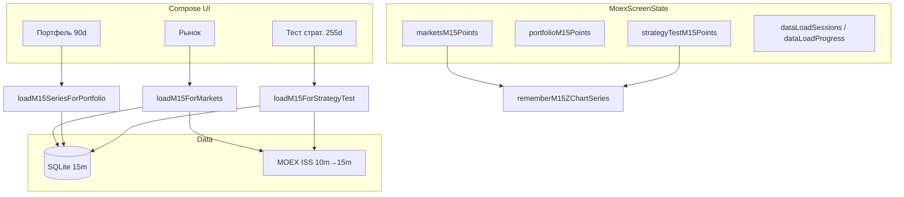

# Handoff для нового чата — MOEX MVP (Android)

Скопируй блок ниже целиком в **новый чат** (Cloud Agent / Cursor). Старый чат перегружен контекстом — продолжай отсюда.

---

## PROMPT (вставить в новый чат)

```
Репозиторий: https://github.com/dimonix2019/111
Пакет: com.example.moexmvp
Ветка: cursor/fix-landscape-3m-crash-4bf2
PR: #45 (base: main)
Текущая версия: 1.7.42 (versionCode 160)
APK CI: https://github.com/dimonix2019/111/releases/download/moexmvp-debug-latest/moexmvp-debug.apk

Задача: приложение всё ещё падает на устройстве (вылеты/ANR), несмотря на много правок в этой ветке. Нужна стабильность, а не новые фичи.

Контекст продукта:
- Android Kotlin + Jetpack Compose, MOEX ISS (TATN/TATNP spread), вкладки: Рынок, Портфель, Тест страт., Журнал, Песочница, О приложении.
- 15м ряд: ISS 10м → 15м, кэш Room (portfolio_m15_spread), rolling Z 30д.
- Z-график: свечи, pan/zoom, landscape fullscreen только на «Рынок».

Что уже сделано в ветке (1.7.31–1.7.42) — НЕ ломать без причины:
- Landscape 3M crash: marketsZChartPeriod отдельно от daily refresh; график в Dispatchers.Default (rememberM15ZChartSeries).
- X-axis время слева→направо; тестовые кнопки Long/Short в портфеле.
- Прогресс-бар: dataLoadSessions + кэш/MOEX чанки (MoexDataLoadProgress.kt, MoexScreenStateDataLoad.kt).
- Портфель: график Z убран; 15м только 90д (PORTFOLIO_TAB_M15_LOOKBACK_DAYS).
- Рынок: периоды только 1D/1W/1M/3M (MARKETS_UI_PERIODS, MarketsPeriodSelector); lookback по периоду (marketsM15LookbackDays); старт ~38д для 1D.
- Оптимизация графика: capPointsBeforeChartBuild, CHART_MAX_DISPLAY_BARS=2000, MOEX 10m OHLC только если ряд ≤500 (M15_CHART_SPREAD_OHLC_MAX_POINTS).
- Тест страт.: strategyTestM15Points отдельно от portfolioM15Points (255д); LazyColumn fillMaxSize; симуляция только на вкладке StrategyTest.
- Unit tests: ./gradlew :app:testDebugUnitTest (~144 теста), CI build-apk.yml.

Константы lookback (критично):
- PORTFOLIO_M15_LOOKBACK_DAYS = 255 — Тест страт., SQLite retention
- PORTFOLIO_TAB_M15_LOOKBACK_DAYS = 90 — Портфель
- marketsM15LookbackDays(period) = visibleDays + 30 + 7 — Рынок (макс. 3M ≈ 127д)
- loadM15ForMarkets / loadM15SeriesForPortfolio / loadM15ForStrategyTest — MoexScreenStateDataLoad.kt

Ключевые файлы:
- UI: MoexScreen.kt, MoexScreenTabMarkets.kt, MoexScreenTabPortfolio.kt, MoexScreenTabStrategyTest.kt
- State/effects: MoexScreenState.kt, MoexScreenEffects.kt, MoexScreenStatePortfolioRefresh.kt, MoexScreenStateHydrate.kt
- 15м/MOEX: MoexIssPortfolio15m.kt, MoexPortfolio15mCache.kt, PortfolioM15Room.kt
- График: MoexChartsM15Series.kt, MoexChartsUiSeries.kt, MoexChartsCanvasCandlestick.kt, MoexChartsUiLandscape.kt
- Периоды: MoexMarketsPeriods.kt, MoexChartsMarkers.kt (marketsM15LookbackDays)
- Тест страт.: MoexStrategyTestLoad.kt, MoexPortfolioUiStrategyTest.kt
- Тесты: MoexAppRegressionTest.kt, MoexMarketsM15ZChartTest.kt

Известные причины прошлых падений (проверить logcat):
1. LazyColumn + Modifier.weight без fillMaxSize → infinity height (исправлено на StrategyTest; проверить другие вкладки).
2. Построение Z-графика на main thread / OOM на 8k+ баров → downsample + фон (частично).
3. loadPortfolio15mDataPoints читал 255д из Room при коротком UI → queryCutoffMillis по from (исправлено).
4. reportDataLoadProgress(null) в finally до конца фоновой MOEX → dataLoadSessions (исправлено).
5. FULL_REFRESH dao.deleteAll() при обновлении портфеля → wipeAllOnFullRefresh=false для портфеля/стратегии.
6. Смешение portfolioM15Points (90д) с симуляцией 255д → strategyTestM15Points (исправлено).

Что сделать в первую очередь (приоритет):
1. Получить logcat при падении: adb logcat | rg -i "FATAL|AndroidRuntime|moexmvp" — точный stack trace.
2. Воспроизвести: холодный старт → Рынок 3M landscape; Тест страт. → Обновить/MOEX заново; смена вкладок во время загрузки.
3. Если OOM: уменьшить CHART_MAX_DISPLAY_BARS, отключить buildM15ZChartDisplayWithSpreadOhlc на «Тест страт.», лениво не держать 255д в памяти (только метрики симуляции без полного List в state).
4. Если ANR: убедиться что buildZStrategyPortfolioMetrics и applyZScoresDefault не на Main; StrictMode в debug.
5. Не расширять scope — минимальный фикс по stack trace.

Команды:
cd /workspace  # или clone repo
git checkout cursor/fix-landscape-3m-crash-4bf2
./gradlew :app:testDebugUnitTest
./gradlew :app:assembleDebug

Правила ветки: cursor/<name>-4bf2, commit+push, PR #45 update, version bump в app/build.gradle.kts + APP_CHANGELOG в MoexConstants.kt.

Файл handoff в репо: handoff_prompt_new_chat.md
```

---

## Краткая карта архитектуры



## Таблица: сколько 15м баров грузится

| Вкладка / действие | Lookback (дней) | ~баров |
|--------------------|-----------------|--------|
| Рынок 1D | 38 | ~1 300 |
| Рынок 1W | 44 | ~1 500 |
| Рынок 1M | 67 | ~2 300 |
| Рынок 3M (макс.) | 127 | ~4 300 |
| Портфель | 90 | ~3 000 |
| Тест страт. | 255 | ~8 000+ (тяжело!) |
| SQLite retention | max(255, 90, 127) | — |

## Что НЕ трогать без необходимости

- `marketsZChartPeriod` vs `selectedPeriod` — landscape не должен вызывать `refreshMarketsDailyOnly` + полный MOEX.
- `RollingSpreadStatsCache` в `MoexZScore.kt`.
- Разделение `MoexScreenState.kt` на partial files (уже разбито).

## Гипотезы если «всё равно падает»

1. **OOM на Тест страт.** — 255д в `strategyTestM15Points` + симуляция + график; нужен streaming/ downsampling до записи в state или симуляция без хранения полного ряда в `mutableStateOf`.
2. **Двойная загрузка** — `refreshData` + `ensureMarketsM15ForPeriod` + `LaunchedEffect(selectedTab)` гонки; `refreshMutex` есть, но фоновые `launchScope.launch` могут наслаиваться.
3. **Старая сборка на телефоне** — проверить versionName 1.7.42 в «О приложении».
4. **Падение в native/Canvas** — очень длинные серии свечей; снизить `CHART_MAX_DISPLAY_BARS` до 1200.
5. **StrictMode / NetworkOnMainThread** — в `loadState` для daily markets.

## История коммитов (ветка)

```
042298c fix: Strategy Test tab crash (1.7.42)
402f4e3 landscape Markets periods 1.7.41
23220b1 remove 6M/1Y + chart opt 1.7.40
2480809 markets M15 by period 1.7.39
4367dbd portfolio no chart 90d 1.7.38
c83452a progress bar live 1.7.37
b5e619f progress bars 1.7.36
0de6dd7 regression tests 1.7.35
```

## Для агента

- Читай `handoff_prompt_new_chat.md` и блок PROMPT выше.
- Сначала **logcat**, потом минимальный фикс.
- Не раздувай контекст — один PR, один корневая причина за итерацию.
- После фикса: тесты + version bump + push `cursor/...-4bf2` + PR #45.
