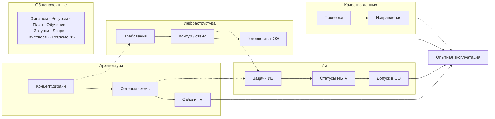

# Примеры документов: карта + планирование

Три рабочих артефакта. Confluence не заменять — это отчётный слой.
Личный слой: карта (поток) + реестр (фокус недели) + карточка задачи (следующий шаг).

---

## 1. Карта стримов (главный документ)

Файл: `karta_strimov.svg` — открыть в браузере / draw.io (File → Import).

Что на карте есть:
- дорожки стримов
- последовательность внутри стрима
- схождение в Опытную эксплуатацию
- жёлтым — фокус недели

Чего на карте нет:
- почта, чат, протоколы, папки
- все 8 общепроектных веток
- полный список задач Confluence

Обновление: 15 минут в пятницу. Перерисовывать с нуля не нужно.

### Тот же каркас в Mermaid (вставить в Confluence / Notion / draw.io)



---

## 2. Мини-карта Архитектуры

Файл: `karta_arhitektura.svg`

Для дэйли и встречи по стриму: 4 блока, не перечень задач.

Definition of Done (пример, подставить свои формулировки):

| Этап | Готово, когда |
|---|---|
| Концепт | Есть версия документа, замечания ИБ/инфра либо закрыты, либо явно в бэклоге |
| Сетевые схемы | Схемы на общем диске, соответствуют концепту, ссылка в реестре |
| Сайзинг | Таблица заполнена, согласована с инфраструктурой, входит в пакет ОЭ |
| Пакет ОЭ | Артефакты архитектуры приложены к контрольной точке ОЭ |

---

## 3. Реестр недели (таблица)

Один файл Excel / Google / markdown. Не больше 15–20 активных строк.

Пример заполнения (вымышленные, но в вашей логике):

| ID | ★ | Стрим | Задача | Следующий шаг (одно действие) | Блокирует ОЭ | Срок | Статус | Источник |
|---|---|---|---|---|---|---|---|---|
| T-01 | ★ | Архитектура | Сайзинг по концепту | Заполнить лист CPU/RAM по схеме DMZ | да | 28.08 | в работе | диск `\arch\sizing.xlsx`; концепт v0.3 |
| T-02 | ★ | ИБ | Закрыть замечания до допуска | Ответить на 3 пункта из протокола статусов ИБ | да | 29.08 | жду ИБ | протокол 15.08; ИИ: «замечания ИБ ОЭ» |
| T-03 | ★ | Инфра | Готовность стенда | Уточнить у инфры дату контура письмом | да | 30.08 | в работе | встреча 22.08, письмо Иванова |
| T-04 |  | Архитектура | Сетевые схемы | Дорисовать сегмент X | да | 04.09 | очередь | диск `\arch\net\`; концепт §4 |
| T-05 |  | Качество данных | Проверки к ОЭ | Выяснить, блокирует ли ОЭ | нет? | 05.09 | разобрать | Confluence DQ-12 |
| T-06 |  | Общепроектные | Отчётность / Scope | Только если спросят на дэйли | нет | — | не трогать | доска Confluence |
| T-07 |  | ИБ | Список задач ИБ | Сверить со статусной встречей | да | 01.09 | очередь | доска + чат ИБ |

Правило колонки «Источник»: одна строка, куда кликнуть. Не копировать текст письма в таблицу.

---

## 4. Карточка одной задачи (когда на слух «не понял»)

Печатать / один слайд / лист блокнота. Заполнять за 5 минут до или после встречи.

```
ЗАДАЧА: ________________________________
СТРИМ: Архитектура / ИБ / Инфра / другое

ЗАЧЕМ (для ОЭ / для вехи): ________________
ОТ ЧЕГО ЗАВИСИТ: _________________________
ЧТО БУДЕТ ЕСЛИ НЕ СДЕЛАТЬ: _______________
СЛЕДУЮЩИЙ ШАГ (30–90 мин): _______________
КОМУ СПРОСИТЬ (1 человек): _______________
ГДЕ ЛЕЖИТ: почта / чат / протокол / диск / Confluence ID
```

Пример:

```
ЗАДАЧА: Сайзинг контура ОЭ
СТРИМ: Архитектура
ЗАЧЕМ: без цифр инфра не подтвердит стенд, ИБ не закроет допуск
ОТ ЧЕГО ЗАВИСИТ: сетевые схемы + нагрузка из концепта
ЧТО БУДЕТ ЕСЛИ НЕ СДЕЛАТЬ: сдвиг контрольной точки ОЭ
СЛЕДУЮЩИЙ ШАГ: заполнить 1 лист CPU/RAM по DMZ
КОМУ СПРОСИТЬ: архитектор инфры Иванов
ГДЕ ЛЕЖИТ: \\disk\arch\sizing.xlsx ; протокол арх 12.08
```

---

## 5. Письменный статус вместо дэйли (5–7 строк)

```
Статус 24.08
• Архитектура: сайзинг — лист DMZ в работе; схемы без изменений
• ИБ: жду ответы по 3 замечаниям из протокола 15.08
• Инфра: письмом уточняю дату готовности контура
• На неделе закрываю: T-01, T-02, T-03
• После 1.09 / некритично: качество данных, общепроектные
• Блокер: нет / есть: …
```

---

## 6. Разбор почты и «забытых» задач

На каждый элемент — одно решение, затем строка в реестр или отказ:

| Решение | Куда |
|---|---|
| Делаю на этой неделе | ★ в реестр (возможно вместо одной из трёх, если критичнее) |
| Позже, есть дата | реестр без ★ |
| Жду от X | статус «жду», пинг в календарь |
| Только для отчёта на дэйли | оставить в Confluence, в реестр не тащить |
| Дубль / мусор | закрыть |

---

## 7. Связь источников (не смешивать в одну доску)

```
Карта          → поток и зависимости
Реестр         → что делать на этой неделе
Confluence     → отчётность и «про что спросят»
Почта / чат    → входящие; раз в день пакетом
Протоколы + ИИ → поиск «где решили»; ссылка в «Источник»
Папки ПК       → черновики
Общий диск     → master: концепт, схемы, сайзинг
```

---

## Как пользоваться на этой неделе

1. Открыть `karta_strimov.svg`, жёлтым пометить свои 3 задачи.
2. Заполнить реестр (15 строк max) из почты + списка задач.
3. На каждую ★-задачу — одна карточка «следующий шаг».
4. Confluence не перестраивать.
5. В пятницу: подвинуть блоки на карте, не перерисовывать всё.
